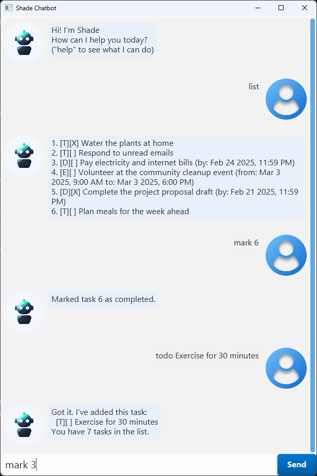

# Shade User Guide



Shade Chatbot is an interactive task management assistant designed to help you stay organized. It supports adding tasks, setting deadlines, scheduling events, and managing your task list efficiently. With its simple commands and intuitive interface, Shade Chatbot is your personal productivity companion.

> **Note:**  
> Words in angle brackets are the parameters to be supplied by the user.  
> e.g. in `todo <task>`, `<task>` is a parameter which can be used as `todo Water the plants`.
> 
> Items in square brackets are optional.  
> e.g `<YYYY-MM-DD> [HH:mm]` can be used as `2025-03-03 09:00` or as `2025-03-03`.

## Help

The `help` command displays a list of all available commands and their descriptions.

Usage: `help`

## Adding To-Do Tasks

The `todo` command lets you add a general task without a specific date or time.

Usage: `todo <task>`

Example
```text
todo Buy groceries
```

The chatbot will confirm that the to-do task has been added:
```text
Got it! I've added this task:
[T][ ] Buy groceries
Now you have 3 tasks in the list.
```

## Adding deadlines

The `deadline` command allows you to add a task with a specific due date (and optional time) to your task list.

Usage: `deadline <task> /by <YYYY-MM-DD> [HH:mm]`

> **TIP:**  
> If no time is provided, it will default to 23:59.

Example
```text
deadline Submit assignment /by 2025-02-20 23:59
```

The chatbot will confirm that the deadline task has been added:
```text
Got it! I've added this task:
[D][ ] Submit assignment (by: Feb 20 2025, 11:59 PM)
Now you have 4 tasks in the list.
```

## Adding Events

The `event` command allows you to schedule an event with a start and end date/time.

Usage: `event <task> /from <YYYY-MM-DD> [HH:mm] /to <YYYY-MM-DD> [HH:mm]`

> **TIP:**  
> If no time is provided, it will default to 23:59.

Example
```text
event Team meeting /from 2025-02-22 14:00 /to 2025-02-22 16:00
```

The chatbot will confirm that the event has been scheduled:
```text
Got it! I've added this task:
[E][ ] Team meeting (from: Feb 22 2025, 2:00 PM to: Feb 22 2025, 4:00 PM)
Now you have 5 tasks in the list.
```

## Listing Tasks

The `list` command displays all tasks currently in your task list.

Usage: `list`

```text
1. [T][ ] Buy groceries
2. [D][ ] Submit assignment (by: Feb 20 2025, 11:59 PM)
3. [E][ ] Team meeting (from: Feb 22 2025, 2:00 PM to: Feb 22 2025, 4:00 PM)
```

## Searching for Tasks

The `find` command allows you to search for tasks containing specific keywords. The search is case-insensitive.

Usage: `find <task keyword>`

Example
```text
find groceries
```

Tasks matching the keyword will be displayed:
```text
3. [T][ ] Restock groceries
5. [T][ ] Discard expired groceries
```

## Marking and Unmarking Tasks

The `mark` and `unmark` commands let you mark a task as done or undo that status.

Usage: `mark <task number>` and `unmark <task number>`

The task number refers to the index number shown in the displayed task list.

Example
```text
mark 1
unmark 5
```

## Deleting Tasks

The `delete` command removes a specific task from your list.

Usage: `delete <task number>`

The task number refers to the index number shown in the displayed task list.

Example
```text
delete 1
```

The chatbot will confirm the deletion:
```text
Noted. I've removed this task:
[T][ ] Buy groceries
Now you have 4 tasks in the list.
```

## Exiting the Chatbot
Use the `quit` command to exit Shade Chatbot.

Usage: `quit`

## Saving the data
Task data are saved in the hard disk automatically after the program closes. There is no need to save manually.

## Editing the data file
Task data are saved automatically as a JSON file [JAR file location]/data/tasks.json. Advanced users are welcome to update data directly by editing that data file.

> **CAUTION:**  
> If your changes to the data file makes its format invalid, Shade will discard all data and start with an empty data file at the next run. Hence, it is recommended to take a backup of the file before editing it.
> Furthermore, certain edits can cause Shade to behave in unexpected ways (e.g., if a value entered is outside of the acceptable range). Therefore, edit the data file only if you are confident that you can update it correctly.
